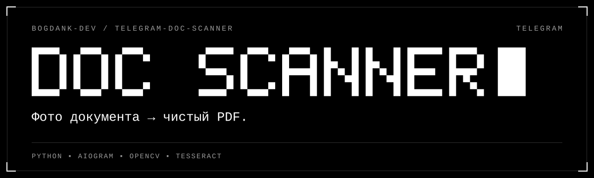

Telegram-бот. Отправь фото документа — получи скан в PDF.

Бот сам находит края листа, выравнивает перспективу и убирает тени.

## Что умеет

- **Скан.** Края листа, перспектива, тени — автоматически.
- **Фильтры.** Ч/Б, Серый, Цвет, Оригинал.
- **PDF.** Несколько фото или альбом — один файл A4.
- **Удостоверение.** Обе стороны на одном листе A4, в натуральную величину.
- **Текст.** Распознаёт русский, казахский, английский. PDF с поиском.
- **Язык.** Интерфейс на русском и английском.

## Приватность

Всё работает на твоём компьютере. Никаких сторонних сервисов.
Документы живут только в памяти и стираются через 24 часа.
На диск пишется одно: выбранный язык (`prefs.json`).

## Запуск (Windows)

1. Создай бота у [@BotFather](https://t.me/BotFather): `/newbot`. Сохрани токен.
2. Поставь [Python](https://www.python.org/downloads/). Отметь **Add python.exe to PATH**.
3. `install_ocr.bat` — распознавание текста. Можно пропустить.
4. `start.bat` — вставь токен. Бот запущен.
5. `autostart.bat` — старт вместе с Windows. Повторный запуск выключает.

Бот работает, пока открыто окно и компьютер не спит.

## Настройки — `.env`

| Параметр | Что делает |
|---|---|
| `BOT_TOKEN` | Токен от @BotFather |
| `ALLOWED_USERS` | Кому доступ: ID или @username через запятую. Пусто — всем. Свой ID: `/myid` |
| `OCR_LANG` | Языки распознавания. По умолчанию `rus+kaz+eng` |
| `TESSERACT_CMD` | Путь к `tesseract.exe`, если не найден сам |
| `DEFAULT_FILTER` | Фильтр новых страниц: `bw`, `gray`, `color`, `orig` |

После правки — перезапусти бота.

## Если не работает

| Проблема | Решение |
|---|---|
| Бот молчит | Окно открыто? Компьютер не спит? Интернет есть? Лог: `bot.log` |
| Нет кнопки «Распознать текст» | Запусти `install_ocr.bat`, перезапусти бота |
| «Границы листа не определены» | Тёмный однотонный фон, все четыре угла в кадре |
| «Файл превышает 20 МБ» | Лимит Telegram. Отправь как фото |

## Стек

Python · aiogram 3 · OpenCV · Pillow · pypdf · Tesseract
